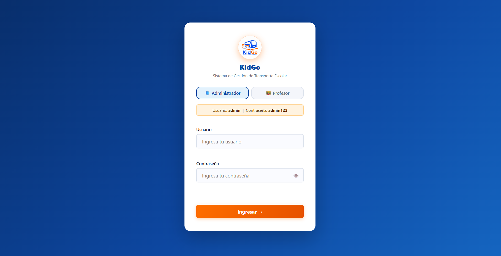
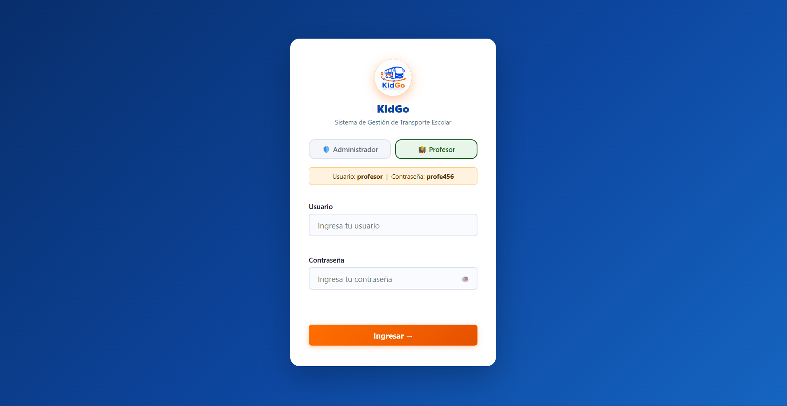
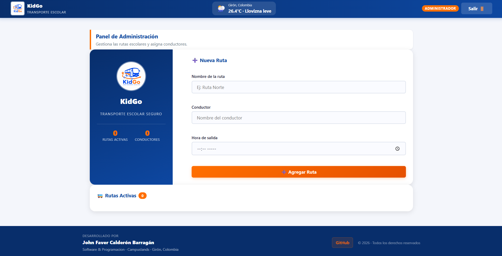
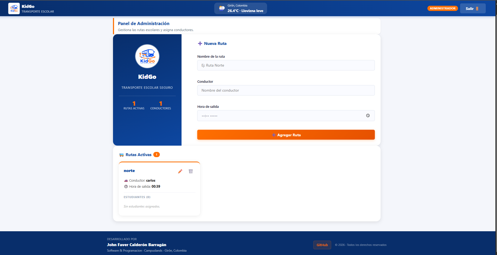
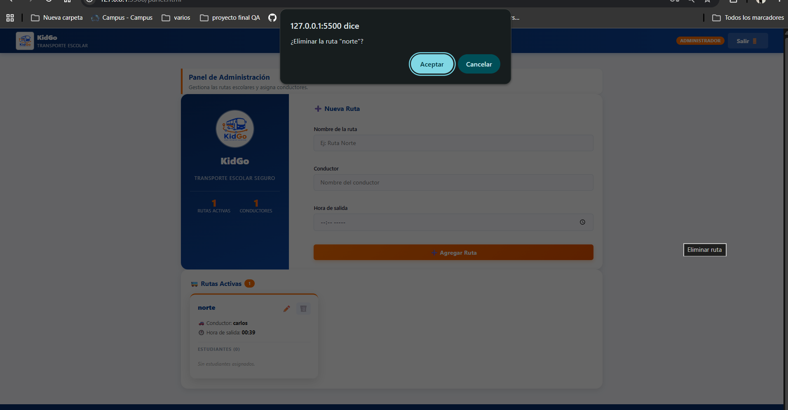
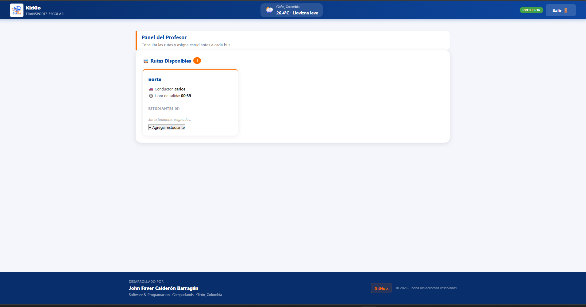
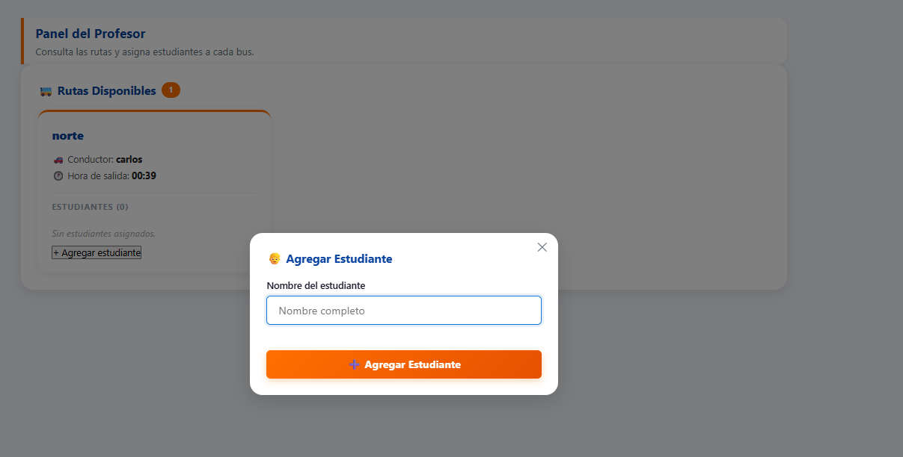
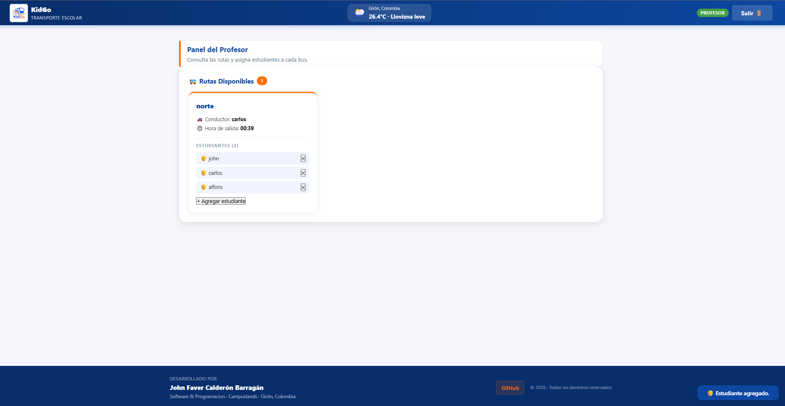

# 🚌 KidGo — Rutas Seguras Kids

> Sistema frontend de gestión de transporte escolar con autenticación por roles, persistencia en LocalStorage y consumo de API pública.


---

## 📋 Descripción

**KidGo** es una aplicación web desarrollada con HTML, CSS y JavaScript puro (Vanilla JS), sin librerías ni frameworks externos. Permite a una empresa de transporte escolar gestionar rutas, conductores y estudiantes a través de dos roles con acceso diferenciado.

| Rol | Acceso |
|---|---|
| 🛡️ **Administrador** | Crear, editar y eliminar rutas; asignar conductores y horarios |
| 👨‍🏫 **Profesor** | Consultar rutas activas y asignar estudiantes a cada bus |

---

## ✨ Características

- 🔐 Login con selección de rol y verificación de credenciales
- 💾 Persistencia en **LocalStorage** — rutas y sesión se mantienen al recargar la página
- 🚌 CRUD completo de rutas: crear, editar y eliminar
- 👦 Asignación y eliminación de estudiantes por ruta
- 🌤️ Clima en tiempo real con la API pública **Open-Meteo** (sin API key)
- 🧩 Web Component `<tarjeta-ruta>` con `<template>` y **Shadow DOM**
- 📡 Comunicación entre componentes mediante **CustomEvent**
- 📊 Panel de identidad de empresa con contadores de rutas en tiempo real
- 🔔 Notificaciones toast de feedback al usuario
- 📱 Diseño responsive con 3 breakpoints (900px / 600px / 380px)
- 🔒 Protección de página: redirige al login si no hay sesión activa
- 🖼️ Soporte para logo de empresa en login y encabezado

---

## 🗂️ Estructura del proyecto

```
KidGo/
│
├── index.html              # Página de inicio de sesión
├── panel.html              # Panel principal (protegido — requiere sesión activa)
├── styles.css              # Estilos completos del proyecto
├── README.md
├── .gitignore
│
├── imagenes/               # Logo y capturas del proyecto
│   ├── logo.png
│   ├── inicio_de_sesion_admin.png
│   ├── inicio_de_sesion_profe.png
│   ├── panel_admin.png
│   ├── panel_profe.png
│   ├── ruta_agregada.png
│   ├── eliminacion_de_rutas.png
│   ├── agregar_estudiante.png
│   └── tarjeta_con_estudiantes.png
│
└── js/
    ├── almacenamiento.js   # Lee y guarda sesión y rutas en LocalStorage
    ├── autenticacion.js    # Usuarios, roles y protección de páginas
    ├── formularios.js      # Validación de campos de formularios
    ├── notificaciones.js   # Mensajes toast de feedback al usuario
    ├── eventos-rutas.js    # Canal de comunicación entre componentes (CustomEvent)
    ├── clima.js            # Consulta la API de clima Open-Meteo (fetch + async/await)
    ├── tarjeta-ruta.js     # Web Component <tarjeta-ruta> con Shadow DOM
    ├── inicio-sesion.js    # Lógica del formulario de login
    └── panel.js            # Lógica principal del panel (estado, modales, renderizado)
```

---

## 🚀 Cómo ejecutar

**Opción 1 — Live Server (recomendado):**
1. Abre la carpeta del proyecto en VS Code.
2. Click derecho en `index.html` → **Open with Live Server**.

**Opción 2 — Directo en el navegador:**
1. Abre `index.html` con doble clic.

> No requiere Node.js, npm ni instalación de dependencias.

---

## 🔐 Credenciales de acceso

| Rol | Usuario | Contraseña |
|---|---|---|
| Administrador | `admin` | `admin123` |
| Profesor | `profesor` | `profe456` |

> Las credenciales están definidas en `autenticacion.js` en el arreglo `USUARIOS_DEL_SISTEMA`.

---

## 🌐 API utilizada

| API | Uso | Autenticación |
|---|---|---|
| [Open-Meteo](https://open-meteo.com) | Temperatura y condición climática actual | Sin API key |

Coordenadas configuradas para **Girón, Santander, Colombia** (`lat: 7.07`, `lon: -73.11`).
Para cambiar la ciudad, edita `LATITUD_CIUDAD` y `LONGITUD_CIUDAD` en `clima.js`.

---

## 🎓 Conceptos aplicados

| Concepto | Archivo |
|---|---|
| Manipulación dinámica del DOM | `panel.js`, `tarjeta-ruta.js` |
| Validación de formularios | `formularios.js` |
| Asincronía — `fetch` + `async/await` | `clima.js` |
| Web Components + `<template>` + Shadow DOM | `tarjeta-ruta.js` |
| CustomEvent — bus de eventos personalizado | `eventos-rutas.js` |
| LocalStorage — persistencia de datos | `almacenamiento.js` |
| Control de acceso por roles | `autenticacion.js` |
| Diseño responsive — 3 breakpoints `@media` | `styles.css` |
| Footer fijo al fondo con Flexbox | `styles.css` — `.app`, `.main` |

---

## 📸 Capturas de pantalla

### 🔐 Inicio de sesión — Administrador

<p align="center">
  
  <br/>
  <em>Pantalla de login con rol Administrador seleccionado</em>
</p>

---

### 🔐 Inicio de sesión — Profesor

<p align="center">
  
  <br/>
  <em>Pantalla de login con rol Profesor seleccionado</em>
</p>

---

### 🛡️ Panel del Administrador

<p align="center">
  
  <br/>
  <em>Panel de administración — logo de empresa, contadores y formulario de nueva ruta</em>
</p>

---

### 📍 Ruta creada

<p align="center">
  
  <br/>
  <em>Vista del administrador con una ruta registrada en el sistema</em>
</p>

---

### 🗑️ Eliminación de ruta

<p align="center">
  
  <br/>
  <em>Confirmación de eliminación de una ruta activa</em>
</p>

---

### 👨‍🏫 Panel del Profesor

<p align="center">
  
  <br/>
  <em>Panel del profesor — visualización de rutas disponibles</em>
</p>

---

### ➕ Agregar estudiante

<p align="center">
  
  <br/>
  <em>Modal para agregar un estudiante a una ruta disponible</em>
</p>

---

### 👦 Tarjeta con estudiantes asignados

<p align="center">
  
  <br/>
  <em>Tarjeta de ruta con estudiantes asignados y notificación toast de confirmación</em>
</p>

---

## 👨‍💻 Autor

**John Faver Calderón Barragán**
Software & Programacion — Campuslands · Girón, Santander, Colombia

[](https://github.com/Johncalderonb)